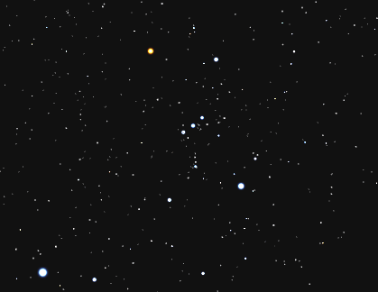

## Bright Star Catalogue in JSON format, optimised for games and visualisation software

This catalog offers star positions both as `x,y,z` coordinates for
**3D software**, and right ascension / declination for **2D software**. It
targets video game developers and visualisation artists that need easy-to-use,
real star catalogs at their disposal.

This catalog contains all
the stars in the [BSC5P](https://heasarc.gsfc.nasa.gov/W3Browse/star-catalog/bsc5p.html)
catalog (all the stars we can see with the naked eye), but with more accurate
information taken from modern stellar data.  It uses
[this catalog](https://github.com/feynmansbongos/BSC5P-JSON) as its base but
adds a huge amount of data, much of which is inferred (such as luminosity and
colour info). [Extra data not inferred](amendmentFactory/amendAsNeeded.js)
include parallax information and popular names manually researched and added
with citations due to these values missing in the original data sources.

Some concessions are made. For example, real spectral data might tell us "this
star is either an A type, or an F type. We're certain it's _one of_ the two,
but unsure which _exactly_." This makes visualisation difficult - we can't draw
a star that's defined as two completely different things. This catalog will in
such cases average between the two possibilities and provide you a single
value. In case this is unwanted, the original spectral data string is still
provided for you to process yourself. Note also that some stars have unique
tacked-on special definitions (officially), meaning that automatic calculation
will produce inaccurate results. In such cases manual adjustment *has* to be
done. Many of these special cases will simply be wrong until a manual
adjustment is made.

The scripts used to create all JSON files are included in this repo in case
anyone needs the data adjusted (see 'Scripts provided' section below).

The [Cosmosis game project](https://github.com/feynmansbongos/Cosmosis) has
successfully used this catalog to generate the following visualisation:

  

### Catalog files
Catalog files are located in the [catalogs](catalogs) directory. Most of them
come in two variants: regular, and minified. Regular is formatted for ease of
human readability while minified is squashed into an unreadable mess easier for
computers to read.

Note that each entry in each file has an ID number (except for
`blackbody.json`). These IDs are used to identify the same stars across files.

**Files provided:**
* `bsc5p_radec`: Bright Star Catalogue 5th edition data. Star positions given 
  in right ascension / declination.
* `bsc5p_3d`: Same data as `bsc5p_radec`, but star locations are expressed as
  `x,y,z` coordinates instead. The center of the universe (coordinates `0,0,0`)
  are located at the center of the ecliptic, in other words very close to
  Earth. Units are in parsecs. Now you can be the center of the universe in 
  style.
* `bsc5p_names`: Contains additional names for each star.
* `bsc5p_spectral_extra`: Contains extra spectral information. Some of it is
  calculated by this application while others are obtained from acedemic
  resources.
* `blackbody`: Contains a table of blackbody temperatures converted to RGB
  colour. This is used internally by this repo's scripts to try dynamically
  generate accurate colour for each star.

<!-- Add when ready:
Note that minified files place each entry on its own line. This adds roughly
1KB size per 1000 stars, but allows you to rapidly find star entries based on
offset rather than parsing.
//
TODO: consider doing real buffered loading. As in, fixed line width. This gives
      us both real json and position independent line reading.
-->

### Script files
See [the build doc](BUILDING.md) if you're a developer wishing to build the
catalogs from scratch yourself.

### JSON keys
Because this catalog primarily targets video games, things are keep small for
faster loading and efficient usage of bandwidth.  JSON keys are usually a
single character (2 characters for `to` / `or` field in the `spectral_extra`
file). This often reduces each file by over 50% which, due to the massive
amount of star data,  equates to megabytes for some files.

The table below describes what each of these keys mean, and lists the files
that use them.

| Key | Type     | Symbol | Used by | Description                  |
| --- | -------- | ------ | ------- | ---------------------------- |
| `i` | number, string | -- | `bsc5p_radec` `bsc5p_3d` `bsc5p_names` `bsc5p_spectral_extra` | Original BSC5P line ID, or 'Custom [n]' if added via the amendments mechanism. Used to link stars between files.
| `n` | string   | --     | `bsc5p_radec` `bsc5p_3d` | A single name given to star. Additional known names for each star stored in [bsc5p_names.json](catalogs/bsc5p_names.json).
| `p` | number   | `pc`   | `bsc5p_radec` `bsc5p_3d` | Distance in parsecs. 1 parsec ≈ 3.26 light-years.
| `r` | number   | `α`    | `bsc5p_radec` | Right ascension in **radians**.
| `d` | number   | `δ`    | `bsc5p_radec` | Declination in **radians**.
| `x` | number   | --     | `bsc5p_3d` | `x` coordinate in parsecs.
| `y` | number   | --     | `bsc5p_3d` | `y` coordinate in parsecs.
| `z` | number   | --     | `bsc5p_3d` | `z` coordinate in parsecs.
| `N` | number   | `L☉`   | `bsc5p_radec` `bsc5p_3d` | Naively calculated luminosity. This does not take dust and other obstruction into account, and can vary several orders of magnitude from real data. This is however still very useful, because being calculated directly from perceived brightness and distance, it gives visualisation software a highly consistent base for realistic-looking 3D calculations. This value may therefore be thought of more as a custom brightness-distance unit than real luminosity. The intended use of this value is generating star size and size falloff based on distance from the software camera (see [Inverse Square Law of Brightness](http://www.astronomy.ohio-state.edu/~pogge/Ast162/Unit1/bright.html)).
| `K` | vector3  | `K`    | `bsc5p_radec` `bsc5p_3d` | Colour of star approximated from star temperature in kelvin (AKA blackbody temperature), converted to RGB. A lot of effort and research has gone into estimating this as physically accurately as humanly possible (while keeping in mind it's still an approximation nonetheless, and will vary by star class and observational quality).

**Spectral information**

Below follows extra spectral information only found in the `bsc5p_spectral_extra` file.

| Key | Type     | Symbol     | Description                                     |
| --- | -------- | ---------- | ----------------------------------------------- |
| `L` | number   | `L☉`   | Real luminosity as determined by academic sources. Very few stars in this catalog have this value defined due to the difficulty in determining it.
| `b` | number   | `m`, `vMag` | Apparent brightness (also known as apparent magnitude, visual magnitude; not to be confused with absolute magnitude).
| `a` | number   | `M`, `VMag` | Naively calculated absolute magnitude. This does not take dust and other obstruction into account.
| `g` | string   | --     | Colour or glow of star, but cartoony instead of real.
| `s` | string   | --     | Spectral classification.
| `C` | string   | -- | Spectral type classification (O, B, A, F, G, K, M).
| `S` | number   | -- | Spectral type subclass (0-9). 0=hottest, 9=coldest. Fractions exist (eg. Mu Normae is O9.7 \[that's an `O`, not a `0`]).
| `L` | number   | -- | Luminosity class. Higher numbers generally mean lower surface temperatures.
| `to` | object or null | -- | If specified, the star is in range of the above and whatever is specified here. Used to indicate uncertainty.
| `or` | object or null | -- | If specified, the star is either the above or whatever is specified in this object. Used to indicate uncertainty.
| `e`¹ | array | -- | Containing siblings, if the original data was presented that way.
| `q` | string   | -- | Skipped spectral information. These usually contain peculiarities in spectral lines, but may also contain data the parser did not understand.

1: Note that the medium- to long-term goal here is to eliminate sibling data altogether, and present that data as separate stars instead.

Flags indicating carbon stars, S-/T-type stars, T Tauri and Wolf-Rayet planned for future versions.

<!--
Spectral data planned for addition in future versions:

| Key | Type     | Description                                     |
| --- | -------- | ----------------------------------------------- |
| `C` | bool     | If true, this is an carbon star. Else not set.
| `R` | bool     | If true, this is an R type (carbon) star. Else not set.
| `D` | bool     | If true, this is an N type (carbon) star. Else not set.
| `S` | bool     | If true, this is an S type star. Else not set. As a side note, a significant fraction of S type stars are variable.
| `T` | bool     | If true, this is a T Tauri star. Else not set.
| `W` | bool     | If true, this is a Wolf-Rayet star. Else not set.
-->

## Note on interpreted spectral data
Parsing spectral luminosity data is insanely complex because of how
un-computer-friendly it is. For example, `A2/3III/V` means we have a star
that's either `A2` or `A3` with a luminosity of either `III` or `V`. This is
what the `/` means: either/or. Of course, an `A2/F1` means it's either an `A2`
or `F1` (notice how the meaning of the `/` is subtly different). It gets worse;
`+` can mean "multi-star system" or it may simply mean "higher luminosity"
depending on context. This script tries its best to process this correctly, and
is known to work with a lot of crazy luminosities (such as
`A5-6/F1III/IVm s+F8-F9:+F1-F2`). A few thousand entries from the BSC5P were
manually verified and confirmed to work correctly. No guarantees are made
however and you're encouraged to raise an issue if you find a problem.

Note that there are some multi-star systems which are, in the opinion of this
writer, incorrectly catalogued, ex: `F0VkA2mA2_lB` (HD 432).
In this case, we have multiple spectral types bundled together with no
delimiter (such as `+`). There are currently no plans to adjust the interpreter
to handle this because previous attempts to do so actually caused some valid
edge cases to come out wrong. These delimit-less classifications might however
be adjusted ad-hoc in future via the `amendmentFactory` mechanism.

#### Known edge cases
This catalog uses SIMBAD's spectral info because it's written more reasonably
than some other sources. For example, HD 143454 has in the past been written as
both `sdBe+gM3+Q0` and `M3IIIe_sh`. The parser will not understand the former
because the class info is garbled in between spectral peculiarity info. The
latter however will work just fine (and is what this catalog uses). In any
case, this script has mechanisms that allow for per-star amendments if needed.

## Source data
Excerpt [from original data source](https://heasarc.gsfc.nasa.gov/W3Browse/star-catalog/bsc5p.html):
> **Overview**
>
> The BSC5P database table contains data derived from the Bright Star Catalog, 5th Edition, preliminary, which is widely used as a source of basic astronomical and astrophysical data for stars brighter than magnitude 6.5. The database contains the identifications of included stars in several other widely-used catalogs, double- and multiple-star identifications, indication of variability and variable-star identifiers, equatorial positions for B1900.0 and J2000.0, galactic coordinates, UBVRI photoelectric photometric data when they exist, spectral types on the Morgan-Keenan (MK) classification system, proper motions (J2000.0), parallax, radial- and rotational-velocity data, and multiple-star information (number of components, separation, and magnitude differences) for known non-single stars.
>
> **References**
>
> Hoffleit, D. and Warren, Jr., W.H., 1991, "The Bright Star Catalog, 5th Revised Edition (Preliminary Version)".
>
> **Provenance**
>
> This table was created by the HEASARC in 1995 based upon a file obtained from either the ADC or the CDS. A number of revisions have been made by the HEASARC to this original version, e.g., celestial positions were added for the 14 non-stellar objects which have received HR numbers: HR 92, 95, 182, 1057, 1841, 2472, 2496, 3515, 3671, 6309, 6515, 7189, 7539 and 8296. In January 2014, the very incorrect position for HR 3671 = NGC 2808 was fixed (the Declination is -65 degrees not +65 degrees!), and smaller corrections were made to the positions of HR 2496, 3515 and 6515 so as to bring them in better agreement with the positions listed in SIMBAD and NED

## Legal
Use of catalog data subject to [HEASARC](https://heasarc.gsfc.nasa.gov/) terms
of use.

Caching query responses from Simbad subject to the
[SIMBAD Astronomical Database](http://simbad.u-strasbg.fr/simbad/) terms of
use.

Conversion scripts included in this project released to public domain under
CC0.

## Acknowledgments
This research has made use of the SIMBAD database, operated at CDS, Strasbourg, France.

This research has made use of the VizieR catalogue access tool, CDS, Strasbourg, France (DOI : 10.26093/cds/vizier). The original description of the VizieR service was published in 2000, A&AS 143, 23.
