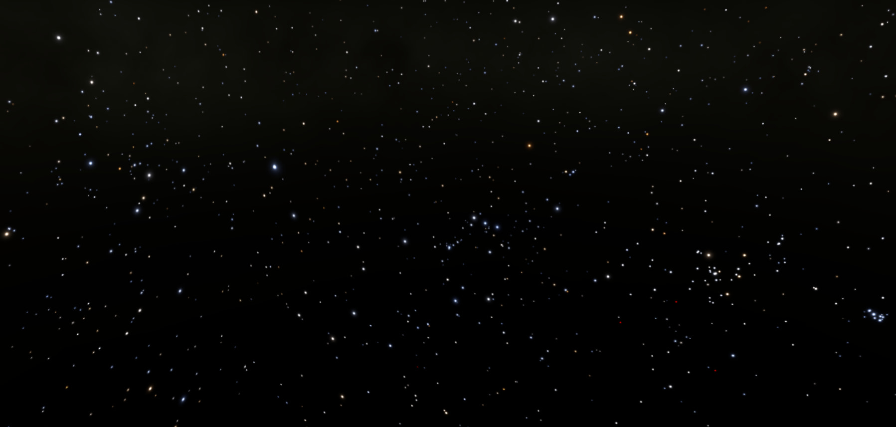

# Alkalurops Library
## Utils for stellar / astronomical calculations

This library contains functions useful for basic astronomical calculations. I'm
no mathematician, nor an astrophysicist, so use at your own risk; some of these
functions may produce invalid values. The values produced *seem* accurate
enough when put through simulation; here's Orion and Canis Major as produced
by the [Cosmosis game project](https://github.com/frostoven/Cosmosis), using
data from this repo:



Note that this project is a subproject of the 
[BSC5P-JSON-XYZ](https://github.com/frostoven/BSC5P-JSON-XYZ)
project, which uses these utils for catalog generation.

## Installation

```bash
npm install @frostoven/alkalurops
```

## Functions available

### Convert degrees and parallax to 3D positions

`project3d({ rightAscension, declination, distance })`

Used to project a star's right ascension, declination, and distance into 3D
coordinates.

Example usage:
```javascript
import project3d from '@frostoven/alkalurops/project3d';

// Get the 3D position of Sirius:
const { x, y, z } = project3d({ 
  rightAscension: 1.7677943505456013,
  declination: -0.291751259921236, 
  distance: 2.637061258933045,
});

// Result:
//  {
//    x: -0.7584977185360743,
//    y: -2.476774158897385,
//    z: -0.4943309217106066,
//  }

```

_Dev note: project3d() uses direction vectors instead of sin/cos trig because,
at the time, I didn't know better. I have no idea if this is bad, but it
certainly appears to work just fine, and is quite performant for datasets under
10,000 stars._

### Luminosity / Effective Temperature conversions

`lumToEffectiveTemperature(luminosity)`<br>
`effectiveTemperatureToLum(temperature)`

Coverts luminosity to
[effective temperature](https://en.wikipedia.org/wiki/Effective_temperature)
and vice-versa. Note that these are approximation functions, and will produce
invalid results under certain conditions.

Example usage 1:
```javascript
import { lumToEffectiveTemperature } from '@frostoven/alkalurops/effectiveTemperature';

const sunLuminosity = 1;
const temperatureKelvin = lumToEffectiveTemperature(sunLuminosity);

// Result:
// temperatureKelvin = 5769.445563017909
```

Example usage 2:
```javascript
import { effectiveTemperatureToLum } from '@frostoven/alkalurops/effectiveTemperature';

const temperatureKelvin = 5772;
const luminosity = effectiveTemperatureToLum(temperatureKelvin);

// Result:
// luminosity = 1.0017721868975924
```

### Convert apparent magnitude to absolute magnitude and back

`calculateAbsoluteMagnitude(apparentBrightness, distance)`<br>
`calculateVisualMagnitude(absoluteMagnitude, distance)`

Example:
```javascript
import { 
  calculateAbsoluteMagnitude, calculateVisualMagnitude
} from '@frostoven/alkalurops/mathUtils';

const visualMagnitude = 6.5;
const distanceParsecs = 100;

const absoluteMagnitude = calculateAbsoluteMagnitude(visualMagnitude, distanceParsecs);
const reverse = calculateVisualMagnitude(absoluteMagnitude, distanceParsecs);
```

_Dev note: Be aware that not all magnitudes found online are measured in
visible light; some include ultraviolet light. This might throw you off. For
example, a star might have a luminosity of 100,000 on a sensor while having a
luminosity of only 10,000 in the visible range._

### Degrees to decimal notation

`degToDecimal(degrees, minute, second)`

Converts DMS notation (`0° 00′ 0.0″`) to decimal.

Example:
```javascript
import { degToDecimal } from '@frostoven/alkalurops/mathUtils';

const degrees = 3;
const minutes = 8;
const seconds = 29.733552923256;

const decimal = degToDecimal(degrees, minutes, seconds);

// Result:
// decimal = 3.141592653589793
```

### Right ascension to decimal or radians

`raToDecimal(hour, minute, second)`<br>
`raToRadians(hour, minute, second)`

Converts right ascension degrees to decimal.

Example:
```javascript
import { raToDecimal, raToRadians } from '@frostoven/alkalurops/mathUtils';

const hours = 3;
const minutes = 8;
const seconds = 28.5;

const decimal = raToDecimal(hours, minutes, seconds);
const radians = raToRadians(hours, minutes, seconds);

// Result:
// decimal = 47.11875
// radians = 0.8223773269240781
```
### Declination to radians

`decToRadians(degrees, minute, second)`

Converts declination to radians.

Example:
```javascript
import { decToRadians } from '@frostoven/alkalurops/mathUtils';

const degrees = 3;
const minutes = 8;
const seconds = 28.5;

const radians = decToRadians(degrees, minutes, seconds);

// Result:
// radians = 0.05482515512827187
```

### Convert kelvin to RGB

`kelvinToRGB(kelvin, blackbodyLookup)`

Converts temperature in kelvin to RGB. Note that, due to the complexity
involved in converting kelvin to color, you need to feed it an appropriate
lookup table with computations pre-backed in. The parent repo has a
[lookup table here](https://github.com/frostoven/BSC5P-JSON-XYZ/blob/primary/catalogs/blackbody.json)
that you can use (beware that it has gamma corrections pre-applied).

Note that the color is a normalised vector. That is, intensity is discarded to
ensure the color can be easily understood by standard software. For any real
applications, you're expected to calculate intensity based on some appropriate
additional value (such as luminosity).

Example, assuming you've downloaded the above table into your project:

```javascript
import { kelvinToRGB } from '@frostoven/alkalurops/mathUtils';
const blackbodyLookup = JSON.parse(fs.readFileSync('./blackbody.json'));

const starTemperature = 5772;
const { r, g, b } = kelvinToRGB(starTemperature, blackbodyLookup);

// Result:
//  {
//    r: 1,
//    g: 0.867,
//    b: 0.813,
//  }
```

Color of the Sun, using the above:


<!--<div style="background-color: rgb(255, 221.085, 207.315);">&nbsp;r: 1 | g: 0.867 | b: 0.813</div>-->

### HR diagram estimation

`estimateTemperatureInKelvin(percentage)`

This loosely mimics how
[Hertzsprung–Russell diagrams](https://en.wikipedia.org/wiki/Hertzsprung%E2%80%93Russell_diagram)
relate spectral classes with luminosities. It's likely to be highly inaccurate
for certain types of stars and should be avoided if possible.

Example usage:
```javascript
import { estimateTemperatureInKelvin } from '@frostoven/alkalurops/hrDiagram';

// Logarithm-like percentage from 0.1 to 1.0, where 0.1 is very hot
// (100,000 K) and 1.0 is cold (800 K or less).
const percentage = 0.5;
const temperature = estimateTemperatureInKelvin(percentage);

// Result:
// temperature = 6000
```

Have a look at
[tempRanges](https://github.com/frostoven/BSC5P-JSON-XYZ/blob/primary/utils/hrDiagram.js#L27)
inside the
[hrDiagram.js](https://github.com/frostoven/BSC5P-JSON-XYZ/blob/primary/utils/hrDiagram.js)
file for more info on how this relates to spectral classes, it has a lot a of
comments describing its setup.


### Misc / extra

Functions that are useful, but that you might already have your own solutions
to.

#### lerp
`lerp(lowest, highest, percentage)`<br>

Linearly interpolates between two values based on a percentage.

Example:
```javascript
import { lerp } from '@frostoven/alkalurops/mathUtils';

// Find the number halfway between 0 and 100:
const halfwayMark = lerp(0, 100, 0.5);

// Result:
// halfwayMark = 50
```

#### degreesToRadians

`degreesToRadians(degrees)`

Converts degrees to radians. Note that, if you have access to a library such as
three.js, you should use their converter instead as its more efficient and
includes a richer set of related functions.

```javascript
import { degreesToRadians } from '@frostoven/alkalurops/mathUtils';

const radians = degreesToRadians(90);

// Result:
// radians = 1.5707963267948966
```


<!--

TODO: document calculateLuminosity and calculateLuminosityWatts.

-->